<h1 align="center"> E101 레서판다 팀 자율 프로젝트 </h1>

## 📝 목차

[프로젝트 개요](#item-one)

[기술 스택](#item-three)

[서버 아키텍처](#item-four)

[서비스 구현 화면](#item-five)

[팀원 소개](#item-two)

[느낀 점](#item-end)

## 📖 프로젝트 개요

<a id="item-one"></a>

<div>

<strong>진행 기간 </strong>: 2023.10.09 ~ 2023.11.17

<strong>목표</strong>

- 문서 정리 + 웹 겁색 + GPT 서비스를 한 페이지에서 한번에 사용할 수 있도록 편의성 제공

- 트리 구조로 문서를 한 눈에 확인

- 그래프 구조를 통해 문서 간 유사도를 연결 + 공유 받은 문서와 내 문서를 연결

- 내가 정리한 문서를 AI가 퀴즈로 만들어줘 복습을 간편하게 할 수 있도록 편의성 제공

</div>

<br/>

## 🛠️ 기술 스택

<a id="item-three"></a>

|          |                                                이슈관리                                                 |                                               형상관리                                                |                                               코드리뷰                                                |                                             커뮤니케이션                                              |                                                  디자인                                                   |                                                  UCC                                                  |
| :------: | :-----------------------------------------------------------------------------------------------------: | :---------------------------------------------------------------------------------------------------: | :---------------------------------------------------------------------------------------------------: | :---------------------------------------------------------------------------------------------------: | :-------------------------------------------------------------------------------------------------------: | :---------------------------------------------------------------------------------------------------: |
| **TOOL** |  |  |  |  |  |  |

<br/>

## 💻 IDE


<br/>

## 📱 Frontend


 


<br/>

## 💾 Backend

 


 
 

 


<br/>

## 🔃 DevOPS


<br/>

## ⚙️ Architecture

<a id="item-four"></a>

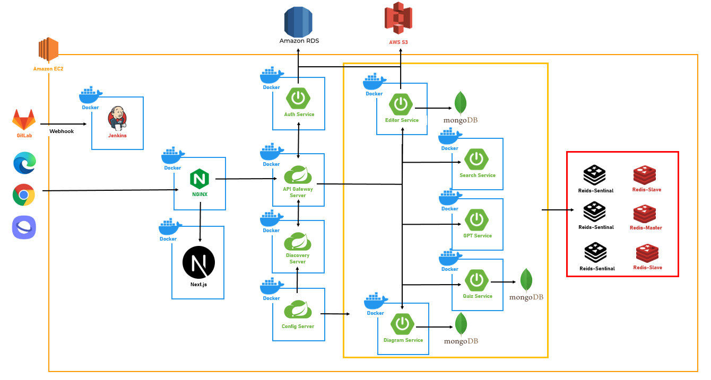

<br/>

## 🗂️ 프로젝트 파일 구조

<a id="item-five"></a>

<details>
<summary>FrontEnd</summary>

```
📦src
 ┣ 📂api
 ┃ ┣ 📂instances
 ┃ ┃ ┗ 📜api.ts
 ┃ ┗ 📂service
 ┃ ┃ ┣ 📜diagram.ts
 ┃ ┃ ┣ 📜editor.ts
 ┃ ┃ ┣ 📜quiz.ts
 ┃ ┃ ┗ 📜user.ts
 ┣ 📂app
 ┃ ┣ 📂editor
 ┃ ┃ ┣ 📂[id]
 ┃ ┃ ┃ ┗ 📜page.tsx
 ┃ ┃ ┗ 📜layout.tsx
 ┃ ┣ 📂main
 ┃ ┃ ┗ 📜page.tsx
 ┃ ┣ 📂quiz
 ┃ ┃ ┣ 📂maker
 ┃ ┃ ┃ ┗ 📜page.tsx
 ┃ ┃ ┣ 📂room
 ┃ ┃ ┃ ┣ 📂[id]
 ┃ ┃ ┃ ┃ ┗ 📜page.tsx
 ┃ ┃ ┃ ┗ 📜page.tsx
 ┃ ┃ ┣ 📜layout.tsx
 ┃ ┃ ┗ 📜page.tsx
 ┃ ┣ 📂search
 ┃ ┃ ┣ 📜page.tsx
 ┃ ┃ ┗ 📜search.css
 ┃ ┣ 📂signin
 ┃ ┃ ┗ 📜page.tsx
 ┃ ┣ 📂signup
 ┃ ┃ ┗ 📜page.tsx
 ┃ ┣ 📜favicon.ico
 ┃ ┣ 📜globals.css
 ┃ ┣ 📜layout.tsx
 ┃ ┣ 📜loading.tsx
 ┃ ┣ 📜not-found.tsx
 ┃ ┣ 📜page.tsx
 ┃ ┗ 📜providers.tsx
 ┣ 📂assets
 ┃ ┗ 📜alone.gif
 ┣ 📂components
 ┃ ┣ 📂brain
 ┃ ┃ ┣ 📜backup.js
 ┃ ┃ ┣ 📜back_brain.js
 ┃ ┃ ┣ 📜back_outlines.js
 ┃ ┃ ┣ 📜Brain.js
 ┃ ┃ ┣ 📜Outlines.js
 ┃ ┃ ┣ 📜SelectShare.tsx
 ┃ ┃ ┗ 📜test.js
 ┃ ┣ 📂category
 ┃ ┃ ┗ 📜Category.tsx
 ┃ ┣ 📂darkmode
 ┃ ┃ ┗ 📜DarkmodeBtn.tsx
 ┃ ┣ 📂editor
 ┃ ┃ ┣ 📜DeleteBtn.tsx
 ┃ ┃ ┣ 📜Editor.module.css
 ┃ ┃ ┣ 📜GPT.css
 ┃ ┃ ┣ 📜GPT.tsx
 ┃ ┃ ┣ 📜Search.tsx
 ┃ ┃ ┣ 📜Search_iFrame.tsx
 ┃ ┃ ┣ 📜Search_noGPTver.tsx
 ┃ ┃ ┣ 📜SharedBtn.tsx
 ┃ ┃ ┣ 📜store.tsx
 ┃ ┃ ┣ 📜TestEditor.tsx
 ┃ ┃ ┗ 📜ToShareBtn.tsx
 ┃ ┣ 📂intro
 ┃ ┃ ┣ 📜backup.js
 ┃ ┃ ┣ 📜css backup.css
 ┃ ┃ ┣ 📜download.svg
 ┃ ┃ ┣ 📜first_note.png
 ┃ ┃ ┣ 📜Intro.css
 ┃ ┃ ┣ 📜Intro.js
 ┃ ┃ ┣ 📜intro_logo.png
 ┃ ┃ ┣ 📜line_shadow.png
 ┃ ┃ ┣ 📜signin.png
 ┃ ┃ ┗ 📜signup_hover.png
 ┃ ┣ 📂quiz
 ┃ ┃ ┣ 📜ChatRoom.tsx
 ┃ ┃ ┣ 📜QuizList.tsx
 ┃ ┃ ┣ 📜QuizMain.tsx
 ┃ ┃ ┣ 📜QuizMaker.tsx
 ┃ ┃ ┣ 📜QuizResult.tsx
 ┃ ┃ ┣ 📜QuizRoom.tsx
 ┃ ┃ ┣ 📜QuizStart.tsx
 ┃ ┃ ┗ 📜Tree.tsx
 ┃ ┣ 📂ui
 ┃ ┃ ┣ 📜Button.tsx
 ┃ ┃ ┣ 📜Card.tsx
 ┃ ┃ ┣ 📜Card2.tsx
 ┃ ┃ ┣ 📜Card3.tsx
 ┃ ┃ ┣ 📜chat.tsx
 ┃ ┃ ┣ 📜Input.tsx
 ┃ ┃ ┣ 📜Label.tsx
 ┃ ┃ ┣ 📜logout.tsx
 ┃ ┃ ┣ 📜Modal.tsx
 ┃ ┃ ┣ 📜Quiz.tsx
 ┃ ┃ ┣ 📜Rank.tsx
 ┃ ┃ ┗ 📜Timer.tsx
 ┃ ┣ 📜Loading.tsx
 ┃ ┣ 📜MySearch.tsx
 ┃ ┣ 📜MySearch_back.tsx
 ┃ ┣ 📜Navbar.tsx
 ┃ ┣ 📜Signin.tsx
 ┃ ┣ 📜Signup.tsx
 ┃ ┗ 📜ThreeScene.tsx
 ┣ 📂context
 ┃ ┣ 📜SocketEditorProvider.tsx
 ┃ ┣ 📜SocketProvider.tsx
 ┃ ┗ 📜SubscribeProvider.tsx
 ┣ 📂hooks
 ┃ ┣ 📜useAllDiagram.ts
 ┃ ┣ 📜useConnectSocket.ts
 ┃ ┣ 📜useCreateChildNote.ts
 ┃ ┣ 📜useCreateNote.ts
 ┃ ┣ 📜useCreateRoom.ts
 ┃ ┣ 📜useCreateSingleRoom.ts
 ┃ ┣ 📜useDeleteNote.ts
 ┃ ┣ 📜useGetNote.ts
 ┃ ┣ 📜useGetQuizHistory.ts
 ┃ ┣ 📜useGetSearchMyNote.ts
 ┃ ┣ 📜useGetSearchResult.ts
 ┃ ┣ 📜useGetSharedMember.ts
 ┃ ┣ 📜useGetShareUserList.ts
 ┃ ┣ 📜useGetUserInfo.ts
 ┃ ┣ 📜useGetUserInfoByNickName.ts
 ┃ ┣ 📜useGetUserNoteList.ts
 ┃ ┣ 📜useGPT.ts
 ┃ ┣ 📜useImageUpload.ts
 ┃ ┣ 📜useLinkNote.ts
 ┃ ┣ 📜useLoading.ts
 ┃ ┣ 📜useNoteList.ts
 ┃ ┣ 📜useReissue.ts
 ┃ ┣ 📜useSendQuizAnswer.ts
 ┃ ┣ 📜useShareDiagram.ts
 ┃ ┣ 📜useSharedNote.ts
 ┃ ┣ 📜useSiginin.ts
 ┃ ┣ 📜useSignup.ts
 ┃ ┣ 📜useUpdateNote.ts
 ┃ ┗ 📜useUsersFindByPkList.ts
 ┣ 📂store
 ┃ ┣ 📜documentsAtom.ts
 ┃ ┣ 📜isSolo.ts
 ┃ ┣ 📜mynoteResults.ts
 ┃ ┣ 📜searchOpen.ts
 ┃ ┗ 📜theme.ts
 ┗ 📂types
 ┃ ┣ 📜diagram.ts
 ┃ ┣ 📜ediotr.ts
 ┃ ┣ 📜quiz.ts
 ┃ ┗ 📜user.ts
```

</details>

<details>
<summary>Backend</summary>

```
📂config
📂gateway
📂discovery
 📂auth
  📂diagram
  📂editor
  📂gpt
  📂quiz
  📂search
```

</details>

<br/>

## 🖥️ 서비스 구현 화면

<a id="item-six"></a>

### 1. 랜딩 페이지 로그인

1.1 랜딩 페이지


- 전체적인 서비스 내용을 한 눈에 보는 랜딩페이지

<br/>

1.2 로그인

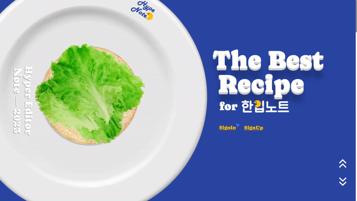

<br/>

### 2. 다이어그램

#### 2.1 내 뇌 보기

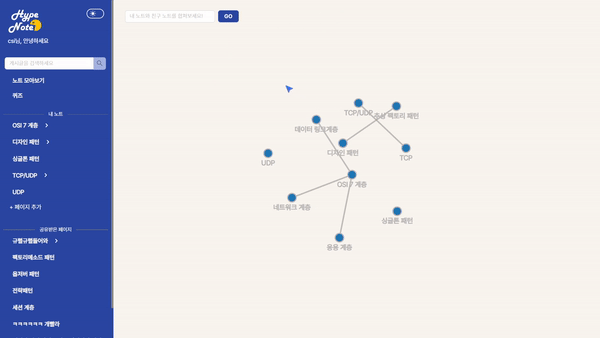

- 나의 문서들을 한눈에 볼 수 있는 페이지

- 노드들을 직접 움직이면서 사용자와 상호작용 및 인터랙티브한 경험 제공

<br/>

#### 2.2 공유 뇌 보기

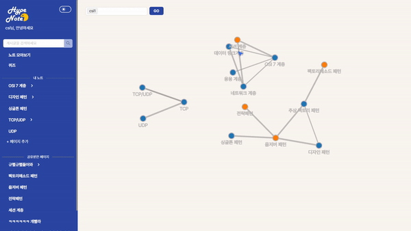

- 공유 받은 문서들과 내 문서들의 유사도를 통해 노드들이 연결
- 한 눈에 연관된 문서들을 확인

<br/>

### 3. Editor

#### 3.1 작성, 수정, 삭제

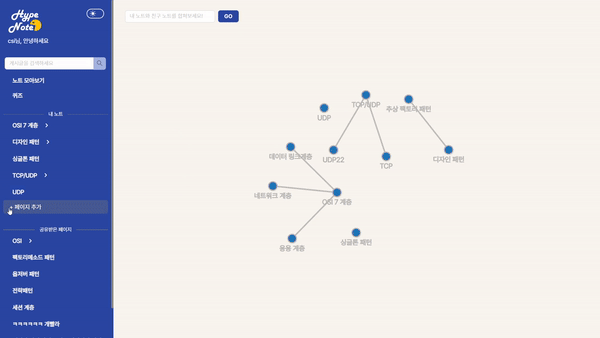

- 마크다운 문법 사용 가능

- 글 작성시 바로 navbar에 연결

<br/>

#### 3.2 공유

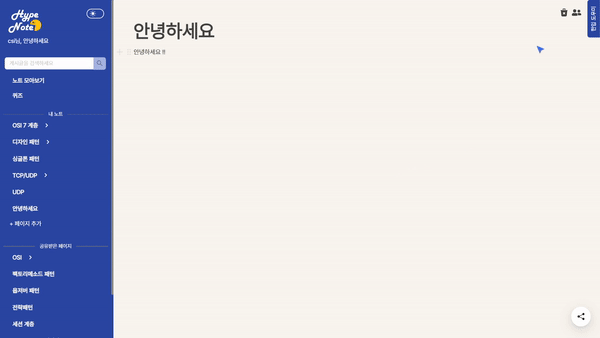

- 문서를 공유하고 싶은 사람들 선택 후 공유 가능

- 문서 하나 공유 시, 해당 자식 노드들 다 공유

<br/>

#### 3.3 동시 작성

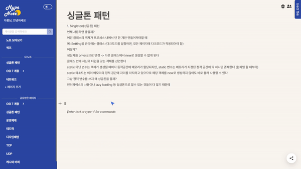

- 공유받은 사람들 간의 동시 작성 가능

<br/>

### 4. GPT


- 문서 작성 페이지 내에서 GPT 검색 가능
- 탭 전환 필요 없이 사용 가능하여 사용자의 편의성 향상

<br/>

### 5. Search

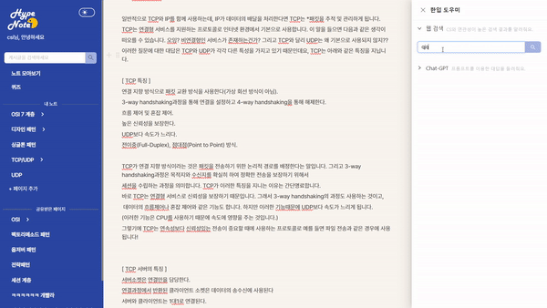

- CS와 관련된 검색 결과 제공

<br/>

### 6. Quiz

#### 6.1 혼자풀기

#### 6.1.1 방만들기

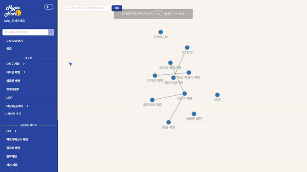

- 나의 문서들을 선택하여 퀴즈 범위 설정

<br/>

#### 6.1.2 퀴즈풀기 + 퀴즈 결과

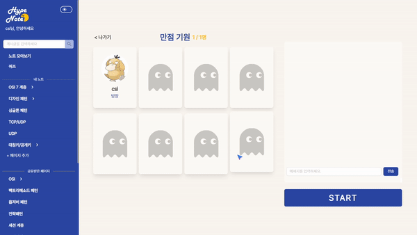

- 퀴즈 결과와 오답과 해설을 한번에 제공

<br/>

#### 6.2 같이풀기

6.2.1 방만들기

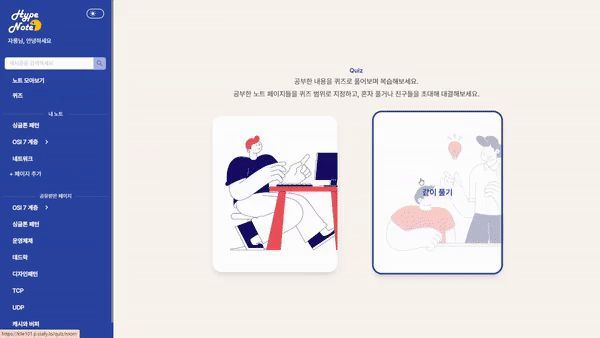

<br/>

6.2.2 대기실 : 레디 및 채팅

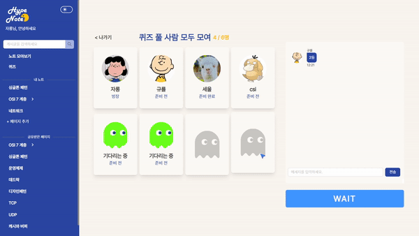

<br/>

6.2.3 퀴즈 풀기

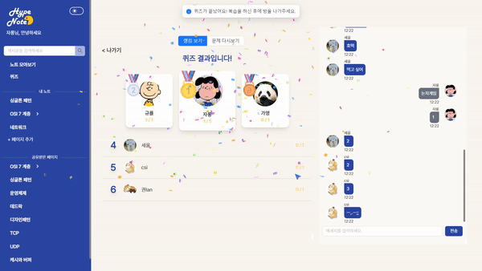

<br/>

6.2.4 퀴즈 결과 : 랭킹 및 오답노트


<br/>

### 7. 다크모드 구현

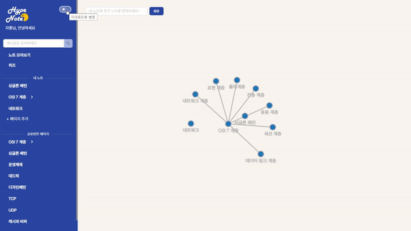

- tailwind를 활용해 한번에 다크모드 전환

<br/>

## 👥 팀원 소개

<a id="item-two"></a>

|   **Name**   |                                권인식                                |                                심규렬                                |                                윤자현                                |                                이가영                                |                                이세울                                |                                최상익                                |
| :----------: | :------------------------------------------------------------------: | :------------------------------------------------------------------: | :------------------------------------------------------------------: | :------------------------------------------------------------------: | :------------------------------------------------------------------: | :------------------------------------------------------------------: |
| **Profile**  | 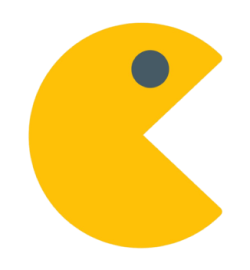 |  |  |  |  |  |
| **Position** |                       Leader(PM) <br/> Backend                       |                               Backend                                |                               Frontend                               |                               Frontend                               |                               Frontend                               |                               Backend                                |
| **Position** |    Infra <br/> MSA 설계 <br/> Auth/Member Server <br/> Gpt Server    |                  Editor Server <br/> Search Server                   |             Auth <br/> Quiz <br/> WebSocket <br/> UX/UI              |     Interactive Web <br/> Diagram <br/> GPT <br/> Search <br/> UX/UI     |           Editor <br/> Tip Tab <br/> WebSocket <br/> UX/UI           |                   Diagram Server <br/> Quiz Server                   |
|   **Git**    |             [GitHub](https://github.com/PassionSoftIan)              |               [GitHub](https://github.com/simgyuryeol)               |               [GitHub](https://github.com/YOONJAHYUN)                |                [GitHub](https://github.com/dfsdf5645)                |                  [GitHub](https://github.com/sl39)                   |                 [GitHub](https://github.com/csi9876)                 |

<br/>

## 영상
SSAFY 9기 2학기 자율 프로젝트 - 한입 노트 (Hype Note) [UCC 보러가기](https://www.youtube.com/watch?v=UKqX69leV5k)  
<br/>
