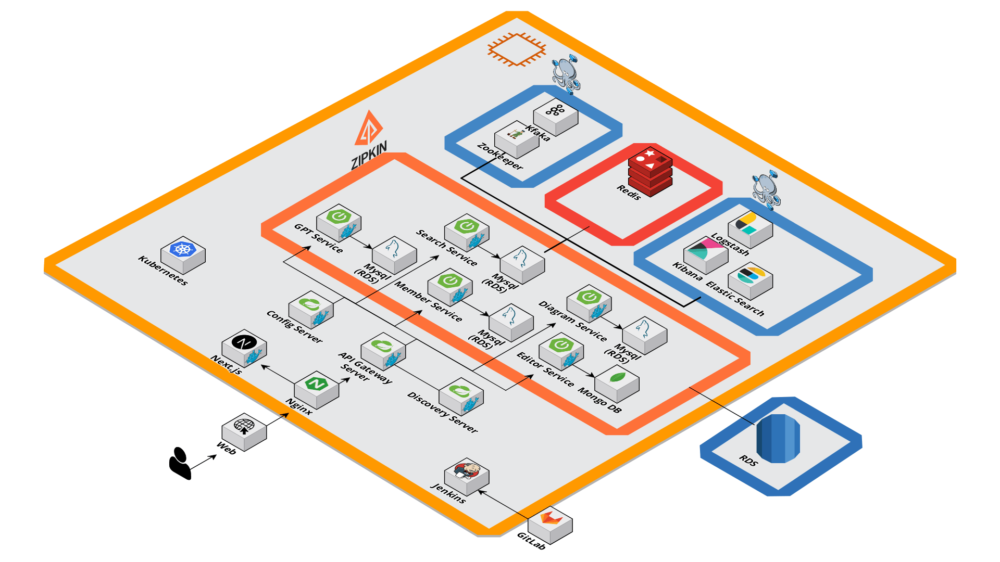

<h1 align="center"> E101 자율 프로젝트 </h1>

## 📝 목차

[프로젝트 개요](#item-one)

[역할 분담](#item-two)

[기술 스택](#item-three)

[서버 아키텍처](#item-four)

[서비스 구현 화면](#item-five)

[느낀 점](#item-end)

## 프로젝트 개요

- <strong>진행 기간</strong>: 2023.10.09 ~ 2023.11.17

- <strong>목표</strong>
  
  - 개발자의 편의를 제공하는 채팅 서비스를 제공합니다.
  
  - 여러가지 툴을 사용하지 않고 하나의 채팅 서비스로 프로젝트를 원활하게 수행합니다.
  
  - 프로젝트 팀원들의 기여도를 확인하고 프로젝트와 관련된 통계 데이터를 제공합니다.

# 프로젝트 확인하기

## 역할 분담

#### <strong>권인식</strong> - 팀장, BE : MSA 설계 ,Auth Server, Gpt Server

#### <strong>심규렬</strong> - BE : Editor Server, Search Server

#### <strong>최상익</strong> - BE : Diagram Server, Quiz Server

#### <strong>윤자현</strong> - FE : Auth, Quiz, WebSocket, UX/UI

#### <strong>이가영</strong> - FE : Interactive, Diagram, GPT, Search, UX/UI

#### <strong>이세울</strong> - FE : Editor, Tip Tab, WebSocket, UX/UI

<a id="item-three"></a> 

## 기술 스택

<a id="item-four"></a>

## **⚙** Management Tool

- 이슈관리 : JIRA

- 형상관리 : Gitlab

- 코드리뷰 : Gerrit

- 커뮤니케이션 : Notion, Mattermost

- 디자인 : Figma

- UCC : 모바비

## 💻 IDE

- VS Code : 1.18.1

- IntelliJ : 11.0.19

## 📱 Frontend

- Next : 13.5.6

- recoil : ^0.7.7

- axios : ^1.6.0

- Node.js : 18.16.1

- stompjs:7.0.0

- react-query: ^3.39.3

- jotai:^2.5.1

## 💾 Backend

- Springboot : 3.1.5

- Lombok

- Spring Data JPA

- Spring Data Redis(lecttuce)

- Spring Web

- Oauth2

- SERVER : AWS EC2 Ubuntu 20.04.6 LTS

- DB : MySQL 8.0.33, Redis, Mongo DB

- websocket

- openfeign

## 🔃 DevOPS

- Nginx

- Docker

- Jenkins

## Architecture




## 프로젝트 구조도


<details>
<summary>FrontEnd</summary>

```
📦src
 ┣ 📂api
 ┃ ┣ 📂instances
 ┃ ┃ ┗ 📜api.ts
 ┃ ┗ 📂service
 ┃ ┃ ┣ 📜diagram.ts
 ┃ ┃ ┣ 📜editor.ts
 ┃ ┃ ┣ 📜quiz.ts
 ┃ ┃ ┗ 📜user.ts
 ┣ 📂app
 ┃ ┣ 📂editor
 ┃ ┃ ┣ 📂[id]
 ┃ ┃ ┃ ┗ 📜page.tsx
 ┃ ┃ ┗ 📜layout.tsx
 ┃ ┣ 📂main
 ┃ ┃ ┗ 📜page.tsx
 ┃ ┣ 📂quiz
 ┃ ┃ ┣ 📂maker
 ┃ ┃ ┃ ┗ 📜page.tsx
 ┃ ┃ ┣ 📂room
 ┃ ┃ ┃ ┣ 📂[id]
 ┃ ┃ ┃ ┃ ┗ 📜page.tsx
 ┃ ┃ ┃ ┗ 📜page.tsx
 ┃ ┃ ┣ 📜layout.tsx
 ┃ ┃ ┗ 📜page.tsx
 ┃ ┣ 📂search
 ┃ ┃ ┣ 📜page.tsx
 ┃ ┃ ┗ 📜search.css
 ┃ ┣ 📂signin
 ┃ ┃ ┗ 📜page.tsx
 ┃ ┣ 📂signup
 ┃ ┃ ┗ 📜page.tsx
 ┃ ┣ 📜favicon.ico
 ┃ ┣ 📜globals.css
 ┃ ┣ 📜layout.tsx
 ┃ ┣ 📜loading.tsx
 ┃ ┣ 📜not-found.tsx
 ┃ ┣ 📜page.tsx
 ┃ ┗ 📜providers.tsx
 ┣ 📂assets
 ┃ ┗ 📜alone.gif
 ┣ 📂components
 ┃ ┣ 📂brain
 ┃ ┃ ┣ 📜backup.js
 ┃ ┃ ┣ 📜back_brain.js
 ┃ ┃ ┣ 📜back_outlines.js
 ┃ ┃ ┣ 📜Brain.js
 ┃ ┃ ┣ 📜Outlines.js
 ┃ ┃ ┣ 📜SelectShare.tsx
 ┃ ┃ ┗ 📜test.js
 ┃ ┣ 📂category
 ┃ ┃ ┗ 📜Category.tsx
 ┃ ┣ 📂darkmode
 ┃ ┃ ┗ 📜DarkmodeBtn.tsx
 ┃ ┣ 📂editor
 ┃ ┃ ┣ 📜DeleteBtn.tsx
 ┃ ┃ ┣ 📜Editor.module.css
 ┃ ┃ ┣ 📜GPT.css
 ┃ ┃ ┣ 📜GPT.tsx
 ┃ ┃ ┣ 📜Search.tsx
 ┃ ┃ ┣ 📜Search_iFrame.tsx
 ┃ ┃ ┣ 📜Search_noGPTver.tsx
 ┃ ┃ ┣ 📜SharedBtn.tsx
 ┃ ┃ ┣ 📜store.tsx
 ┃ ┃ ┣ 📜TestEditor.tsx
 ┃ ┃ ┗ 📜ToShareBtn.tsx
 ┃ ┣ 📂intro
 ┃ ┃ ┣ 📜arrow.png
 ┃ ┃ ┣ 📜backup.js
 ┃ ┃ ┣ 📜bite.png
 ┃ ┃ ┣ 📜bun_bottom.png
 ┃ ┃ ┣ 📜bun_top.png
 ┃ ┃ ┣ 📜cheese.png
 ┃ ┃ ┣ 📜css backup.css
 ┃ ┃ ┣ 📜download.svg
 ┃ ┃ ┣ 📜first_note.png
 ┃ ┃ ┣ 📜glowparticle.js
 ┃ ┃ ┣ 📜Intro.css
 ┃ ┃ ┣ 📜Intro.js
 ┃ ┃ ┣ 📜intro_logo.png
 ┃ ┃ ┣ 📜krlogo.png
 ┃ ┃ ┣ 📜left.png
 ┃ ┃ ┣ 📜left_hover.png
 ┃ ┃ ┣ 📜lettuce.png
 ┃ ┃ ┣ 📜line.png
 ┃ ┃ ┣ 📜line2.png
 ┃ ┃ ┣ 📜line3.png
 ┃ ┃ ┣ 📜line_shadow.png
 ┃ ┃ ┣ 📜logo.png
 ┃ ┃ ┣ 📜logo_blue.png
 ┃ ┃ ┣ 📜patty.png
 ┃ ┃ ┣ 📜plate.png
 ┃ ┃ ┣ 📜signin.png
 ┃ ┃ ┣ 📜signin_hover.png
 ┃ ┃ ┣ 📜signup.png
 ┃ ┃ ┗ 📜signup_hover.png
 ┃ ┣ 📂quiz
 ┃ ┃ ┣ 📜ChatRoom.tsx
 ┃ ┃ ┣ 📜QuizList.tsx
 ┃ ┃ ┣ 📜QuizMain.tsx
 ┃ ┃ ┣ 📜QuizMaker.tsx
 ┃ ┃ ┣ 📜QuizResult.tsx
 ┃ ┃ ┣ 📜QuizRoom.tsx
 ┃ ┃ ┣ 📜QuizStart.tsx
 ┃ ┃ ┗ 📜Tree.tsx
 ┃ ┣ 📂ui
 ┃ ┃ ┣ 📜Button.tsx
 ┃ ┃ ┣ 📜Card.tsx
 ┃ ┃ ┣ 📜Card2.tsx
 ┃ ┃ ┣ 📜Card3.tsx
 ┃ ┃ ┣ 📜chat.tsx
 ┃ ┃ ┣ 📜Input.tsx
 ┃ ┃ ┣ 📜Label.tsx
 ┃ ┃ ┣ 📜logout.tsx
 ┃ ┃ ┣ 📜Modal.tsx
 ┃ ┃ ┣ 📜Quiz.tsx
 ┃ ┃ ┣ 📜Rank.tsx
 ┃ ┃ ┗ 📜Timer.tsx
 ┃ ┣ 📜Loading.tsx
 ┃ ┣ 📜MySearch.tsx
 ┃ ┣ 📜MySearch_back.tsx
 ┃ ┣ 📜Navbar.tsx
 ┃ ┣ 📜Signin.tsx
 ┃ ┣ 📜Signup.tsx
 ┃ ┗ 📜ThreeScene.tsx
 ┣ 📂context
 ┃ ┣ 📜SocketEditorProvider.tsx
 ┃ ┣ 📜SocketProvider.tsx
 ┃ ┗ 📜SubscribeProvider.tsx
 ┣ 📂hooks
 ┃ ┣ 📜useAllDiagram.ts
 ┃ ┣ 📜useConnectSocket.ts
 ┃ ┣ 📜useCreateChildNote.ts
 ┃ ┣ 📜useCreateNote.ts
 ┃ ┣ 📜useCreateRoom.ts
 ┃ ┣ 📜useCreateSingleRoom.ts
 ┃ ┣ 📜useDeleteNote.ts
 ┃ ┣ 📜useGetNote.ts
 ┃ ┣ 📜useGetQuizHistory.ts
 ┃ ┣ 📜useGetSearchMyNote.ts
 ┃ ┣ 📜useGetSearchResult.ts
 ┃ ┣ 📜useGetSharedMember.ts
 ┃ ┣ 📜useGetShareUserList.ts
 ┃ ┣ 📜useGetUserInfo.ts
 ┃ ┣ 📜useGetUserInfoByNickName.ts
 ┃ ┣ 📜useGetUserNoteList.ts
 ┃ ┣ 📜useGPT.ts
 ┃ ┣ 📜useImageUpload.ts
 ┃ ┣ 📜useLinkNote.ts
 ┃ ┣ 📜useLoading.ts
 ┃ ┣ 📜useNoteList.ts
 ┃ ┣ 📜useReissue.ts
 ┃ ┣ 📜useSendQuizAnswer.ts
 ┃ ┣ 📜useShareDiagram.ts
 ┃ ┣ 📜useSharedNote.ts
 ┃ ┣ 📜useSiginin.ts
 ┃ ┣ 📜useSignup.ts
 ┃ ┣ 📜useUpdateNote.ts
 ┃ ┗ 📜useUsersFindByPkList.ts
 ┣ 📂store
 ┃ ┣ 📜documentsAtom.ts
 ┃ ┣ 📜isSolo.ts
 ┃ ┣ 📜mynoteResults.ts
 ┃ ┣ 📜searchOpen.ts
 ┃ ┗ 📜theme.ts
 ┗ 📂types
 ┃ ┣ 📜diagram.ts
 ┃ ┣ 📜ediotr.ts
 ┃ ┣ 📜quiz.ts
 ┃ ┗ 📜user.ts
```

</details>

<details>
<summary>back-end</summary>

```

```

</details>

## 서비스 구현 화면

#### 1. 랜딩 페이지 로그인

#### 2. 다이어그램

2.1 내 뇌 보기

2.2 공유 뇌 보기

#### 3. Editor

3.1 작성, 수정, 삭제

3.2 공유, 동시 작성

#### 4.GPT

#### 5.Search

#### 6. Quiz

6.1 혼자풀기

6.2 같이풀기

6.1.1 방만들기

6.1.2 대기실 : 레디 및 채팅

6.1.3  퀴즈 풀기

6.1.4 퀴즈 결과 : 랭킹 및 오답노트

## 느낀 점
